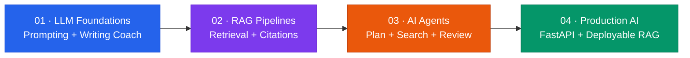
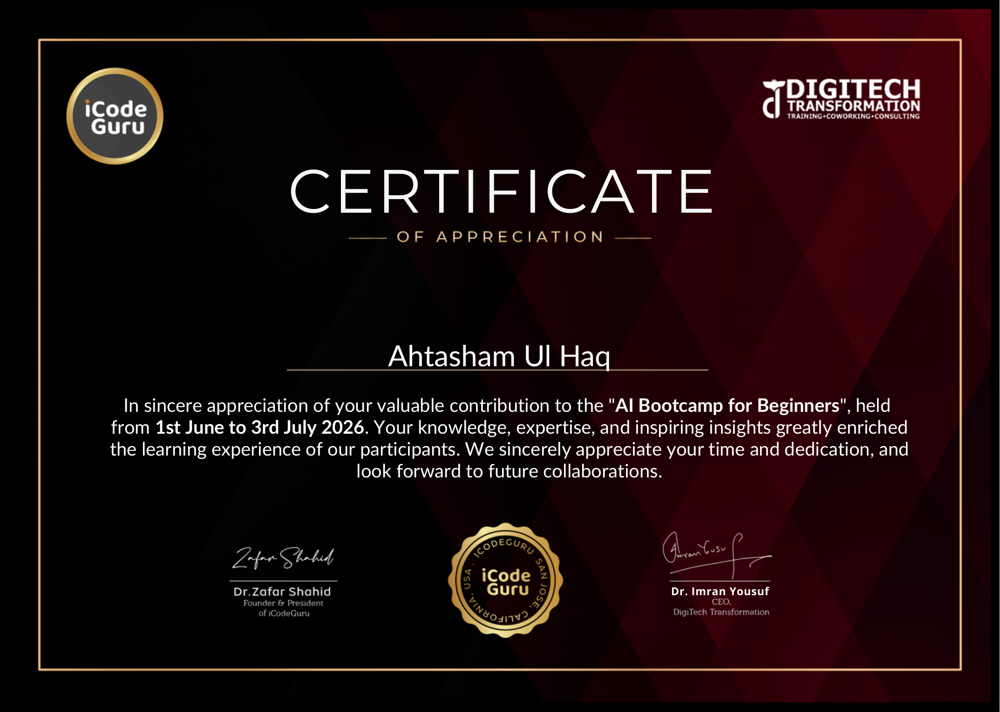

<div align="center">

# **AI Engineering Bootcamp**

### Six live lab sessions. Four weeks. Real AI systems built in public.

[](#volunteering-with-purpose)
[](#the-four-week-build)
[](#session-recordings)
[](#inside-this-repository)

<a href="#session-recordings"></a>
<a href="./bootcamp-outline.pdf"></a>
<a href="#certificate"></a>

**Taught as an Instructor in AI Engineering Bootcamp, Organized by [iCodeGuru](https://www.linkedin.com/company/icode-guru/) and [DigiTech Transformation](https://www.linkedin.com/company/digitech-transformation/).**

</div>

---

## **About This Bootcamp**

I taught as a **Volunteer Instructor** for **underprivileged students**, giving my time to help make practical AI education more accessible. <br>
My teaching days were **Thursday and Friday** - the hands-on lab and revision days - so the materials here centre on building, experimenting, debugging, and shipping.

> **A note on the recordings:** a technical issue meant I could not teach Week 1. The six session recordings below cover my teaching across **Weeks 2-4**.


## **At a glance**

| Signal | Details |
| :-- | :-- |
| 🏢 **Organised by** | [iCodeGuru](https://www.linkedin.com/company/icode-guru/) × [DigiTech Transformation](https://www.linkedin.com/company/digitech-transformation/) |
| 🗓️ **Bootcamp format** | Four weeks, Monday-Friday: theory, guided labs, and weekly revision |
| 🧑‍🏫 **My contribution** | Volunteer Instructor for Thursday/Friday practical labs and revision |
| 🎥 **My teaching archive** | 6 recorded sessions across Weeks 2, 3, and 4 |
| 🎯 **Learning path** | LLM apps → RAG → agents → production AI services |

## **The four-week build**



| Week | Theme | What learners built | Core tools |
| :--: | :-- | :-- | :-- |
| `01` | **LLM Foundations & Prompting** | AI Writing Coach with personas and writing analysis | Streamlit, Groq, JSON |
| `02` | **RAG Pipelines & Document Intelligence** | Retrieval systems from scratch and a YouTube-transcript chatbot | LangChain, FAISS, Hugging Face |
| `03` | **Tool-Using Agents & Multi-Agent Systems** | Autonomous research workflow | LangGraph, Tavily, Groq |
| `04` | **Production, Deployment & Evaluation** | Multi-mode RAG Assistant API and browser UI | FastAPI, FAISS, LangGraph |

<details>
<summary><b>🗺️ Explore the official four-week curriculum</b></summary>
<br />

The complete weekly structure, learning goals, labs, case studies, and deliverables are available in the [Bootcamp Outline PDF](./bootcamp-outline.pdf).

</details>

## **Structure**

```text
ai-engineering-teaching-bootcamp/
│
├── week-1/  
├── week-2/   
├── week-3/ 
├── week-4/  
│
├── bootcamp-outline.pdf
└── certificate.pdf 
```

## **Session recordings**

<div align="center">

### 🎬 Six practical sessions, recorded for learners who want to build along

[](https://youtube.com/playlist?list=PLNDmRVqsNHHg&si=rBTfcEffPmNA_98L)

</div>

| Week | Session | Recording |
| :--: | :-- | :-- |
| `02` | Part 1 | [▶ Watch on YouTube](https://youtu.be/x8Zjy60tzag?si=3Hoy0N9qFzfcSFto) |
| `02` | Part 2 | [▶ Watch on YouTube](https://youtu.be/UGMytXuTRUQ?si=aMaQiyizRqpUxhPi) |
| `03` | Part 1 | [▶ Watch on YouTube](https://youtu.be/8Dp8nar1utg?si=rhaAUEf2Nd5nFeT2) |
| `03` | Part 2 | [▶ Watch on YouTube](https://youtu.be/DpC6qN_43nk?si=NnSrtL-hsrv5WUS5) |
| `04` | Part 1 | [▶ Watch on YouTube](https://youtu.be/e7E5_mhNT_U?si=V0QQumO1t_T8NUt-) |
| `04` | Part 2 | [▶ Watch on YouTube](https://youtu.be/IHdOuBHNUEo?si=FaCfxvED7-74x-vy) |


## **Volunteering with purpose**

> **Talent is everywhere. Opportunity is not.**

I volunteered as an instructor because capable students should not be held back from learning AI by a lack of access. These labs were designed to replace passive consumption with practical confidence: open the notebook, run the code, break it, understand it, and build something of your own.

My thanks to [iCodeGuru](https://www.linkedin.com/company/icode-guru/) and [DigiTech Transformation](https://www.linkedin.com/company/digitech-transformation/) for creating a space where community, mentorship, and technical ambition can meet.

## **Certificate**

<div id="certificate" align="center">

<a href="./certificate.pdf"></a>

<br /><br />

<a href="./certificate.pdf"></a>

</div>

> The certificate is displayed above. Select it to open the original, full-resolution PDF.

---

<div align="center">

### Keep learning. Keep building. Keep opening doors. ✨

Made with care for a community of future AI engineers.

</div>
